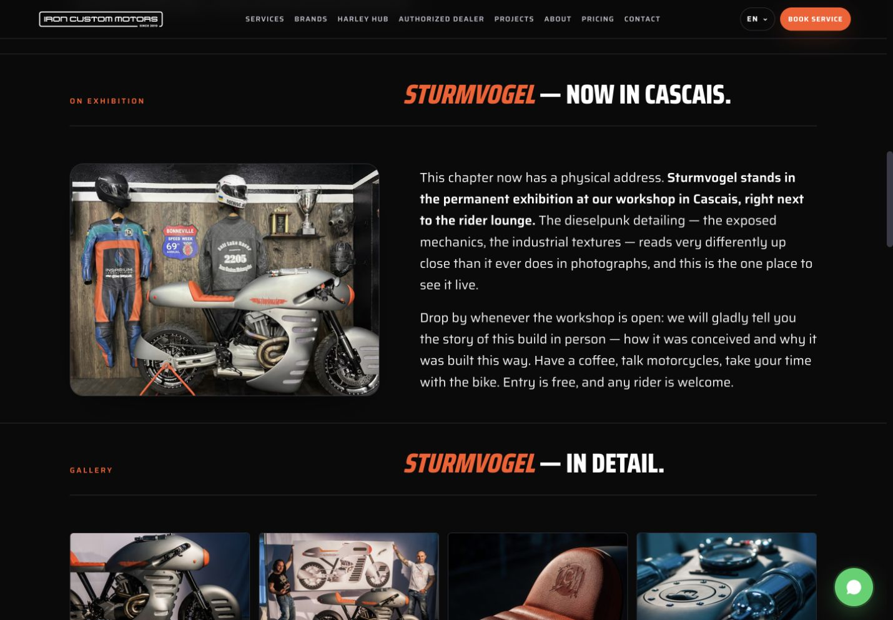
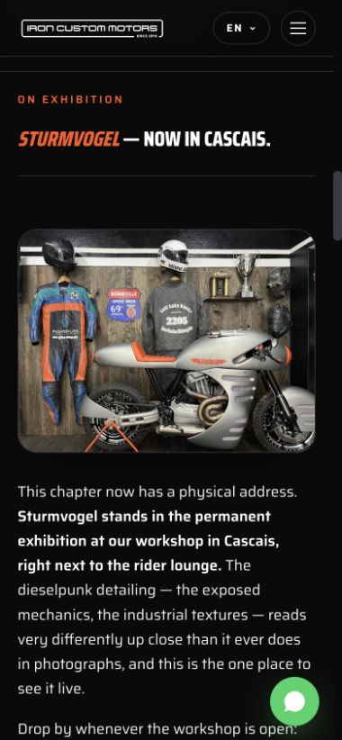
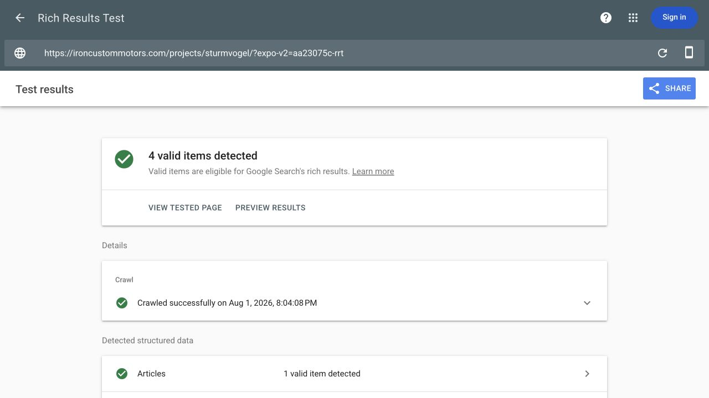

# EXPO-V2 Final Report

Date: 2026-08-01 (Europe/Lisbon)

Implementation commit: `aa23075c8d52fd75a2ae871c26dd45554c2b6637`

Production workflow: `30713880464` (`success`, 38 seconds)

Google Rich Results result: `QtK8FJYbOvDZFu-k-TWBng`

## Outcome

The approved exhibition update is live on Sturmvogel, Beckman and Hell Boy in
all four languages. The common project renderer now supplies a registered
responsive split component: exhibition photo on the left and copy on the right
on desktop, then photo above copy on mobile. The exhibition image is lazy and
dimensioned and never competes with the hero for high fetch priority.

The Hell Boy portfolio tile now shows `2025` in EN, PT, RU and UK.

## Approved Inputs

| Input | SHA-256 |
|---|---|
| `2026-08-01_exhibition-block-v2_4lang.md` | `45871e26ac3fd29647b7cb7de733fd21769418fded8722fb3415ce754754268b` |
| `Sturmvogel.jpeg` | `04723f29f9ec6f48816338f476f67c2020c5d197719978374efa44514f1b33a5` |
| `Beckman.jpeg` | `a49cbfe39ab4f4de93dcd9b48b587414e0a295f82f88b0fccfbd2d17e7e8dd26` |
| `Hellboy.jpg` | `c73585078a868eac1a2e2e4700906b95095b4bdb9a6adc8dd4b9db19d1d6f180` |

The source-copy file creation time,
`2026-08-01T19:17:10+01:00`, is the source-backed modification time used for
the 12 changed detail URLs and four changed project listings.

## Architecture And Files

- `content/projects/legacy_projects_4lang.json`: the 12 exact body replacements,
  stable exhibition markers and regenerated visible-text hashes.
- `scripts/build/project_pages_data.py`: one `PROJECT_EXHIBITION_MEDIA`
  registry containing bases, responsive widths and the 12 approved localized
  ALT strings.
- `scripts/build/build_project_pages.py`: common split renderer and explicit
  responsive `sizes` support.
- `scripts/build/optimize_project_exhibition_images.py`: one reusable media
  command for every registered exhibition section.
- `scripts/build/validate_project_pages.py`: exact split, ALT, responsive
  source, fallback, dimensions, lazy-loading and priority checks.
- `scripts/build/new_pages_data.py`: Hell Boy listing year `2025`.
- `assets/projects.css`: shared desktop/mobile split layout; project CSS stamp
  `20260801a`. `assets/main.css`, all JavaScript and the main asset stamp are
  unchanged.
- `photos/projects/exhibition/`: 18 files, comprising 800 and 1600 pixel AVIF,
  WebP and JPEG variants for each of the three supplied photos.
- 48 project-detail HTML files: 12 contain the approved content/media section;
  the remaining 36 change only the project-family CSS stamp.
- Four `/projects/` listing HTML files: only the Hell Boy year changes visibly.
- `sitemap.xml`: unchanged URL membership and exactly 16 changed lastmod values.
- `docs/CONTENT_TYPES.md` and `scripts/build/README.md`: durable ownership and
  reproduction instructions.
- `docs/reports/EXPO_V2_STURMVOGEL_1440.png`,
  `docs/reports/EXPO_V2_STURMVOGEL_390.png` and
  `docs/reports/EXPO_V2_RRT.png`: visual evidence.

`llms.txt` did not change because the English URL inventory and discovery copy
did not change.

## Exact Copy And Visible-Text Comparison

The attached file was parsed into exactly 12 unique project/language records.
For every record the CURRENT HTML occurred once before replacement, the
REPLACE HTML occurred once afterward, the CURRENT HTML occurred zero times
afterward, and the section marker occurred once.

For each generated detail page, the complete normalized `<main>` text from
`1596bbf0` was transformed only by replacing the approved CURRENT block with
the matching REPLACE block. That calculated text was byte-equal to the new
complete normalized `<main>` text on all 12 pages:

```text
OK: 12 detail pages change visible text only in the approved exhibition body; all replacements and localized ALTs are exact
```

The equivalent full-`<main>` comparison on the four portfolio listings passed
only after one `2015` to `2025` substitution:

```text
OK: four /projects/ variants change visible text only from Hell Boy year 2015 to 2025
```

A repository search for Hell Boy and `2015` in either order returned no match.
The maintained 2025 association is:

```text
scripts/build/new_pages_data.py:446:    {"slug": "hellboy",       "img": "/photos/projects/hellboy-800.jpg",       "year": "2025",
```

## Layout And Browser Evidence

The browser test used the locally generated site before deployment and then
the exact production output after deployment.

At 1440 x 1000 CSS pixels:

```text
gridTemplateColumns: 499.555px 640.461px
media: left 112.594px, top 263.609px, width 499.555px, height 375.164px
story: left 676.945px, top 308.945px, width 640.461px, height 364.484px
```

At 390 x 844 CSS pixels:

```text
gridTemplateColumns: 340px
media: top 261.016px, width 340px, height 255.5px
story: top 552.498px, width 340px, height 438.703px
paragraph opacity: 1
```

The first visual pass exposed that the legacy project script animates only the
first `.proj-story` on a page. The second exhibition story therefore inherited
zero-opacity paragraph styles. The final scoped component CSS makes only the
registered exhibition copy immediately visible; no JavaScript or existing
story behavior changed. Both screenshots below are from the corrected output.





## Media And Priority Evidence

Every generated exhibition picture has two AVIF sources, two WebP sources and
two JPEG fallback candidates at 800 x 600 and 1600 x 1200. The 1600 x 1200
fallback dimensions are present in HTML, reserving the correct 4:3 layout.

Observed at 390 x 844:

```text
exhibitionCurrentSrc: /photos/projects/exhibition/sturmvogel-exhibition-800.avif
exhibitionLoading: lazy
exhibition fetchpriority: absent
fetchpriority="high" elements: 1
fetchpriority="high" + loading="lazy": 0
console errors: 0
```

The common project validator repeated the format, fallback, ALT, dimensions,
lazy and priority checks on all 12 localized pages.

## Sitemap And Cache-Bust

The sitemap URL set is unchanged. Exactly these 16 lastmod values moved to
`2026-08-01T19:17:10+01:00`:

- `/projects/`, `/pt/projects/`, `/ru/projects/`, `/uk/projects/`;
- every language variant of `/projects/sturmvogel/`;
- every language variant of `/projects/beckman/`;
- every language variant of `/projects/hellboy/`.

All other lastmod values stayed byte-identical. Final sitemap SHA-256:

```text
51cca0ab9d5959b56fb39577ca2f410d3c9fa207b100d6069d883e2777d0eef7
```

`assets/projects.css` uses `?v=20260801a` on all project detail pages;
`assets/projects.js` remains `20260710b`; main CSS/JS remain `20260724a`.

## Validator Output

The JavaScript syntax checks, Python compilation and `git diff --check` all
returned exit code 0 without output. The four repository validator groups
reported:

```text
SEO validation passed: 216 sitemap URL(s)
Brand page validation passed: 7 brand page set(s).
Harley Hub validation passed: 12 pages and all required integrations
OK: beckman project page passed multilingual copy, media, schema, cache-bust, redirect and integration checks
OK: burly project page passed multilingual copy, media, schema, cache-bust, redirect and integration checks
OK: cocktail project page passed multilingual copy, media, schema, cache-bust, redirect and integration checks
OK: fighter project page passed multilingual copy, media, schema, cache-bust, redirect and integration checks
OK: geometric project page passed multilingual copy, media, schema, cache-bust, redirect and integration checks
OK: hellboy project page passed multilingual copy, media, schema, cache-bust, redirect and integration checks
OK: inspirium project page passed multilingual copy, media, schema, cache-bust, redirect and integration checks
OK: joker project page passed multilingual copy, media, schema, cache-bust, redirect and integration checks
OK: quanta-r project page passed multilingual copy, media, schema, cache-bust, redirect and integration checks
OK: sturmvogel project page passed multilingual copy, media, schema, cache-bust, redirect and integration checks
OK: true-religion project page passed multilingual copy, media, schema, cache-bust, redirect and integration checks
OK: unbreakable project page passed multilingual copy, media, schema, cache-bust, redirect and integration checks
```

## Clean-Clone Rebuild

A separate no-hardlink clone at implementation commit `aa23075c` ran the
complete documented Full Safe Rebuild, including pricing PDFs and all four
validator groups. The final gate was:

```text
CLEAN_REBUILD_OK: aa23075c8d52fd75a2ae871c26dd45554c2b6637
```

`git status --porcelain` was empty. Binary media optimization was correctly
excluded from the rebuild according to the repository's codec-stability rule.

## Production And Rich Results

GitHub Pages workflow `30713880464` completed successfully in 38 seconds.
Cache-bypass requests with no-cache headers confirmed:

- HTTP 200 and the exact split/media/priority/schema contracts on all 12
  exhibition detail URLs;
- Hell Boy 2025 on all four project listings;
- production `sitemap.xml` byte-equal to the repository file;
- production `assets/projects.css?v=20260801a` byte-equal to the repository
  file.

Google fetched the production EN Sturmvogel URL with a unique query string and
reported four valid items: Article, Breadcrumbs, Local business and
Organization. The result contained zero errors and zero warnings.

[Open Rich Results result](https://search.google.com/test/rich-results/result?id=QtK8FJYbOvDZFu-k-TWBng)



## Acceptance Criteria

1. **PASS** — all 12 exact body replacements and complete visible-text scope
   comparisons passed.
2. **PASS** — one common split works at 1440 and 390 pixels; final screenshots
   are included above.
3. **PASS** — AVIF/WebP/JPEG, responsive widths, lazy loading, explicit
   dimensions and the one-high-priority invariant pass on all 12 pages.
4. **PASS** — Hell Boy is 2025 on every listing; no Hell Boy/2015 association
   remains.
5. **PASS** — sitemap membership is unchanged and exactly the approved 16
   lastmod values moved.
6. **PASS** — only project-family CSS changed; its stamp is uniformly
   `20260801a`. Main CSS/JS and project JS are unchanged.
7. **PASS** — chrome parity, all four validator groups and Google Rich Results
   passed with no errors or warnings.
8. **PASS** — the complete documented rebuild left the clean clone unchanged.

No unresolved implementation risk was introduced by EXPO-V2.
